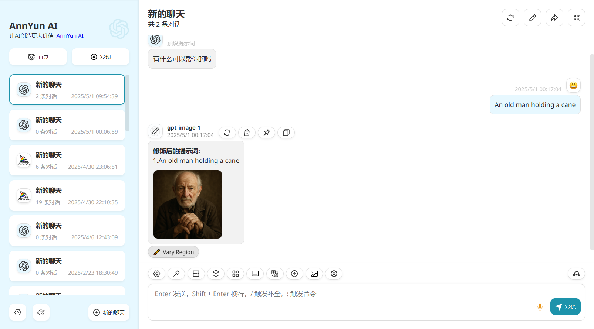
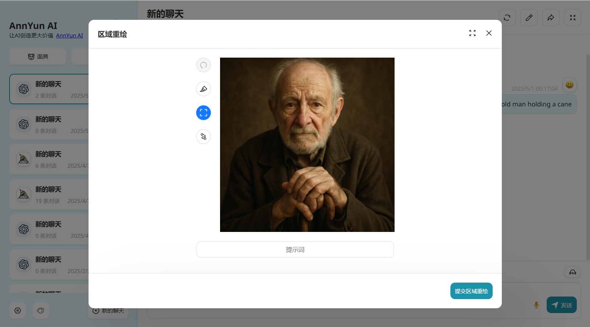
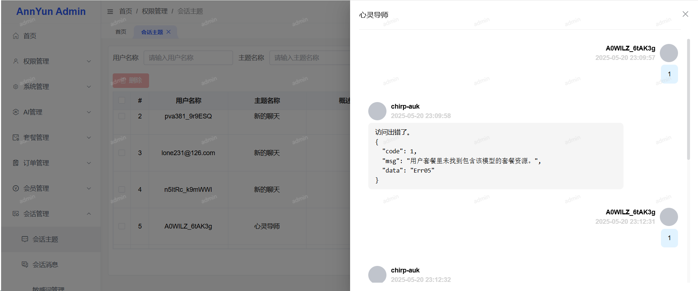

### 声明
    本项目代码没开源，但安全性跟原版ChatGPT-Next-Web完全一致。
    人格保证，所有版本没有任何恶意代码，不会偷key或者泄露key！！！
    如果担心，可自行在部署应用的服务器上安装抓包工具，分析每个对外的请求。

### 欢迎体验另一个项目[lobe-chat-pro](https://github.com/vual/lobe-chat-pro)
    基于lobe-chat，增加了更强大的绘图、音乐、视频面板，支持midjourney、dall-e、suno、luma、runway、快手可灵等，地址：https://github.com/vual/lobe-chat-pro

### 基于new-api的开源项目[aiiai-api](https://github.com/vual/aiiai-api)
### 推荐中转接口，[api.annyun.cn](https://api.annyun.cn/)，免去繁杂配置，获取key就可以用。

### 版本
#### 无后台：
- 更新日期：2025.06.13
- 版本号：
  - 3.9.15，完整功能，需要授权码
  - 3.8.6，免费版，不需要授权码
- **Demo演示地址**：
  - 参考下面有后台版本的用户端，有一些界面和功能差异，没有登录、套餐列表、用户中心，没有管理端。

#### 有后台版本：
- 更新日期：2025.06.13
- 版本号：
  - latest
- **Demo演示地址**：
  - **用户端地址**：https://ai.annyun.cn/ ，支持关注公众号扫码授权登录，也支持邮箱注册，手机号也可以（演示站没有配置）。
  - **管理端地址**：https://admin.annyun.cn/ , 账号：annyun，密码：123456

### 特性介绍
|        | 特性                                                                                             | 无后台（3.8.*） | 无后台（3.9+） | 有后台 |
|--------|------------------------------------------------------------------------------------------------|------------|-----------| -- |
|        | 完整的chatgpt-next-web，每次发版本会合并原版代码                                                               | ✓          | ✓         | ✓ |
| **文件解析** | 解析上传的文件，提取文件内容转成markdown格式内容，一起发给模型分析，支持的文件格式：pdf、word、ppt、excel、image(ocr)、audio、html、txt、zip | ×          | ×         | ✓ |
| 文件上传与存储 | S3存储（推荐直接配置S3，因为兼容：阿里云oss，腾讯cos，minio，aws，cloudflare R2等等，几乎所有支持S3标准的都支持）                      | ×          | ✓         | ✓ |
|        | 阿里云                                                                                            | ✓          | ✓         | ✓ |
|        | 腾讯云                                                                                            | ✓          | ✓         | ✓ |
|        | minio                                                                                          | ✓          | ✓         | ✓ |
|        | 自定义上传接口                                                                                        | ✓          | ✓         | ✓ |
| 画图     | midjourney标准版                                                                                  | ✓          | ✓         | ✓ |
|        | midjourney-plus版（ai换脸，局部重绘等）                                                                   | ×          | ✓         | ✓ |
|        | midjourney独立绘图面板                                                                               | ×          | ✓         | ✓ |
|        | Stable-Diffussion(sd-webui接口)                                                                  | ✓          | ✓         | ✓ |
|        | Dall-E-3（以及走openai画图接口的其他模型）                                                                   | ✓          | ✓         | ✓ |
|        | gpt-image-1（支持重绘）                                                                              | ×          | ✓         | ✓ |
|        | 绘图记录                                                                                           | ✓          | ✓         | ✓ |
| 音乐     | suno(chat格式)                                                                                   | ✓          | ✓         | ✓ |
| 视频     | luma                                                                                           | ×          | ✓         | ✓ |
| 多模态    | 识图、whisper、tts                                                                                 | ✓          | ✓         | ✓ |
| 逆向模型   | gpts、gpt-4o-all                                                                                | ✓          | ✓         | ✓ |
| fastgpt | 把fastgpt知识库当作模型来用                                                                              | ✓          | ✓         | ✓ |
| 其他     | 翻译                                                                                             | ✓          | ✓         | ✓ |
|        | 语音输入                                                                                           | ✓          | ✓         | ✓ |
|        | 朗读文字                                                                                           | ✓          | ✓         | ✓ |
|        | 自定义网站标题、副标题、icon                                                                               | ✓          | ✓         | ✓ |
|        | 时展示用户输入内容的token数量                                                                              | ✓          | ✓         | ✓ |
|        | 会话主题展示模型名称                                                                                     | ×          | ✓         | ✓ |
|        | 增加用户自定义名称和头像                                                                                   | ×          | ✓         | ✓ |
|        | 插件按钮自定义                                                                                        | ×          | ✓         | ✓ |
| 登录注册   | 手机号                                                                                            | ×          | ×         | ✓ |
|        | 邮箱                                                                                             | ×          | ×         | ✓ |
|        | 公众号扫码                                                                                          | ×          | ×         | ✓ |
| AI管理   | 平台管理                                                                                           | ×          | ×         | ✓ |
|        | 模型管理（支持设置是否默认、翻译、总结、识图）                                                                        | ×          | ×         | ✓ |
|        | apikey管理                                                                                       | ×          | ×         | ✓ |
| 套餐管理   | 套餐资源                                                                                           | ×          | ×         | ✓ |
|        | 套餐信息                                                                                           | ×          | ×         | ✓ |
|        | 套餐兑换码                                                                                          | ×          | ×         | ✓ |
| 订单管理   | 订单信息                                                                                           | ×          | ×         | ✓ |
| 会员管理   | 会员信息                                                                                           | ×          | ×         | ✓ |
|        | 会员套餐                                                                                           | ×          | ×         | ✓ |
| 会话管理   | 会话主题                                                                                           | ×          | ×         | ✓ |
|        | 会话消息                                                                                           | ×          | ×         | ✓ |
| 支付方式   | 微信支付                                                                                           | ×          | ×         | ✓ |
|        | 易支付                                                                                            | ×          | ×         | ✓ |
|        | 虎皮椒支付                                                                                          | ×          | ×         | ✓ |
| 其它     | 敏感词管理                                                                                          | ×          | ×         | ✓ |
|        | 快捷提示词管理                                                                                        | ×          | ×         | ✓ |

### 特性（无后台版本）：[详细说明](./docs/无后台版本详细功能说明.md)

### 特性（有后台版本）：[详细说明](./docs/有后台版本详细功能说明.md)

### 无后台版本示例图片
<div style="display: flex;flex-direction: column">
  <div style="display: flex;flex-direction: row;">
    
    
  </div>
  <div style="display: flex;flex-direction: row">
    
    
  </div>
  <div style="display: flex;flex-direction: row">
    
    
  </div>
  <div style="display: flex;flex-direction: row">
    
    
  </div>
  <div style="display: flex;flex-direction: row">
    
    
  </div>
  <div style="display: flex;flex-direction: row">
    
    
  </div>
  <div style="display: flex;flex-direction: row">
    
    
  </div>
<div style="display: flex;flex-direction: row">
    
  </div>
</div>

### 有后台版本示例图片
<div style="display: flex;flex-direction: column">
  <div style="display: flex;flex-direction: row;">
    
    
  </div>
  <div style="display: flex;flex-direction: row">
    
    
  </div>
  <div style="display: flex;flex-direction: row">
    
    
  </div>
  <div style="display: flex;flex-direction: row">
    
    
  </div>
  <div style="display: flex;flex-direction: row">
    
    
  </div>
  <div style="display: flex;flex-direction: row">
    
    
  </div>
<div style="display: flex;flex-direction: row">
    
    
  </div>
<div style="display: flex;flex-direction: row">
    
    
  </div>
</div>


### 参数说明：[详细说明](./docs/参数说明.md)


### 需要准备什么：[详细说明](./docs/需要准备什么.md)

### 无后台版本部署和启动
##### 1.拉取镜像
```shell
docker pull registry.cn-hangzhou.aliyuncs.com/ann-chat/chatgpt-next-web-pro:3.9.15
```
##### 2.启动应用
```shell
docker run -d -p 3000:3000 \
  -e OPENAI_API_KEY="sk-xxxxxx" \
  -e AUTHORIZE_CODE="授权码" \
  registry.cn-hangzhou.aliyuncs.com/ann-chat/chatgpt-next-web-pro:3.9.15
```
- 3000:3000是端口映射，前面的可以自定义，后面的是容器内部端口，不可更改。比如可以改成：3030:3000, 3080:3000
- 如果你有chatgpt中转地址，则加上 -e BASE_URL="https://xxxxxx" \  ，没加这个参数，默认请求到 https://api.openai.com
- 其它参数也是通过增加 -e 然后跟上参数名称和参数值， \ 是换行拼接。

### 有后台版本部署和启动
##### 1.下载docker-compose.yml文件，文件在本项目 /docker/with-backend/目录下
```shell
curl -o docker-compose.yml https://github.com/vual/ChatGPT-Next-Web-Pro/tree/main/docker/with-backend/docker-compose.yml
```
如果下载不了docker-compose.yml，或者下载下来是html文件，则请直接到 /docker/with-backend下查看docker-compose.yml并复制里面的内容，自己创建一个同样名称的yml文件

##### 2.编辑docker-compose.yml文件，根据需要，修改里面的环境变量

##### 3.拉取最新镜像，并启动，如果遇到无法执行 docker-compose 命令，则需要先安装 docker-compose
```shell
docker compose pull
docker compose up -d
```
首次启动建议不加 -d ，看看是否有报错，没报错后，结束运行，并加上 -d 重新启动
##### 详细部署说明请看[后台版本部署步骤](./docs/后台版本部署步骤.md)
##### nginx配置参考[nginx参考配置](./docs/nginx.conf)

### 重要！！！后台管理默认账号密码 admin/123456，进入之后记得马上改密码！

### 常见问题：[常见问题](./docs/常见问题.md)

### 授权码价格
#### 授权绑定你自己的二级域名，绑定后，只能通过绑定的域名访问！！！一年可以改3次绑定的域名！！！
- 也可以绑定公网IP，但不建议。试用可以绑定内网IP。
#### 无后台版本（后续更新也不会接入后台相关功能）：
- 绑定1个域名或IP，限时特惠：￥189/年，￥369/永久
- 绑定2个域名或IP，限时特惠：￥339/年
- 绑定3个域名或IP，限时特惠：￥469/年

#### 有后台版本价格
- 一个授权码，绑定两个域名（用户端和管理端），限时特惠：￥459/年，￥899/永久

（授权不包含源码，源码需要另外付费。可以先试用，试用不收费。）

### 授权码获取方式
微信：822784588


交流群：


